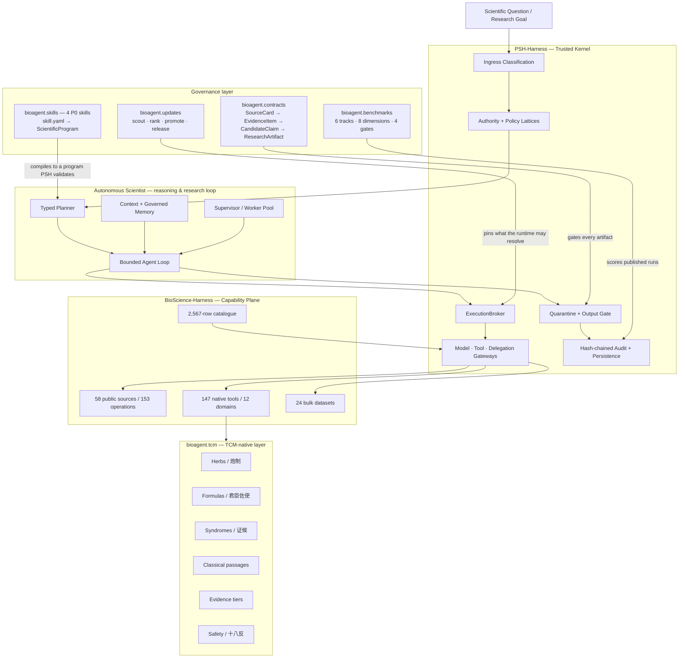
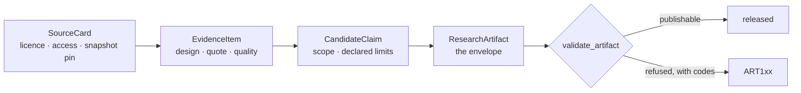
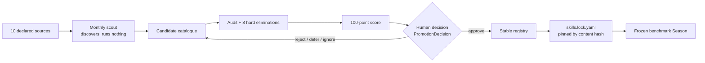

<div align="center">

# TCMScience: An Autonomous Scientist for Traditional Chinese Medicine

### A governed, evidence-grounded and reproducible AI scientist for TCM & biomedical research

**首个面向中医药与生物医学科学发现的受治理自主科研智能体**

[](https://github.com/psknlr/TCMScience/actions/workflows/ci.yml)
[](https://opensource.org/licenses/MIT)
[](https://www.python.org/downloads/)


## Authors

**Yanlan Kang¹† · Ruiqi Liu²† · Shuai Xu³* · Xukun Zhang⁴* · [William Cheng-Chung Chu](https://www.sciopen.com/scholar/info?id=1952658822209773569)⁵***

### Affiliations

¹ Institute of Medical Philosophy & Future AI (IMPF-AI)
² Shanghai Medical College, Fudan University
³ Shanghai Ziranerran Traditional Chinese Medicine Foundation
⁴ Li Ka Shing Faculty of Medicine, The University of Hong Kong
⁵ Fuyao University of Science and Technology

† **These authors contributed equally to this work.**
* **Co-corresponding authors:** Shuai Xu, Xukun Zhang, and William Cheng-Chung Chu


</div>

---

## Overview

**TCMScience** is an open research framework for building an **autonomous scientist for Traditional Chinese Medicine (TCM)**: an AI research system that can plan scientific tasks, retrieve and grade evidence, call biomedical and TCM tools, execute analyses, inspect intermediate results, generate testable hypotheses, verify claims, and release only policy-compliant outputs.

The central design choice is simple:

> **The language model may reason, but it does not define the laws of the laboratory.**

In high-stakes biomedical research, an LLM should not be its own planner, executor, security policy, evidence judge and release authority at the same time. TCMScience therefore separates the **reasoning plane** from the **trusted execution plane**. Model-generated plans are typed, bounded and validated. Data are labelled at ingress. Tool/model/delegation calls must cross explicit gateways. Outputs are quarantined before release. Scientific claims are checked against evidence scope and provenance before they can enter trusted project memory.

TCMScience is inspired by the emerging vision of automated scientific discovery [1] and general-purpose biomedical agents [2], but focuses on a problem that requires additional structure: **TCM knowledge is heterogeneous across classical texts, materia medica, formulas, syndrome theory, modern molecular evidence and clinical studies, and these evidence types must not be silently collapsed into one another.**

### 中文简介

**TCMScience** 是首个面向“**自动中医药科学家（Autonomous TCM Scientist）**”智能体Harness能够围绕一个中医药科学问题，自主完成**任务规划 → 文献/数据库检索 → 证据分级 → 工具调用 → 数据分析 → 假说生成 → 反证与核验 → 结果发布 → 可追溯科研记忆**的闭环。此外模型及智能体基于**规则受控科研环境**工作以保证安全可信。

因此，TCMScience 将：

* **智能体的推理能力**与**系统的执行权限**解耦；
* **经典记载、传统应用、临床前机制、病例、观察性研究、RCT、系统评价**分层建模；
* 将药材、炮制品、方剂、君臣佐使、证候、经典条文、安全禁忌等作为**原生中医药对象**，而不是普通文本字符串；
* 将模型输出默认视为**待验证科研对象**，而不是天然可信的结论；
* 对进入系统的数据、离开系统的输出以及跨模型/工具的调用建立**标签、策略、审计与发布门**。

TCMScience 的目标不是“让 AI 代替科学家做判断”，而是构建一个能够进行**可验证、可审计、可复现科学工作的自主研究系统**。

---

## Why TCMScience?

### From a chatbot to a scientist

A scientific agent must do more than answer questions.

| Conversational agent               | TCMScience autonomous scientist                                 |
| ---------------------------------- | --------------------------------------------------------------- |
| Generates an answer                | Builds and executes a research plan                             |
| Retrieves text                     | Retrieves evidence with provenance and scope                    |
| Calls tools opportunistically      | Calls tools through typed, policy-gated capabilities            |
| Mixes evidence in free text        | Separates evidence tiers and claim types                        |
| Produces a final response directly | Quarantines, verifies and releases output                       |
| Treats TCM as unstructured text    | Models herbs, formulas, syndromes, classics and safety natively |
| Keeps conversational memory        | Commits only governed, verified project memory                  |
| Can silently overclaim             | Must expose unsupported/extrapolated claims                     |

### Why governance matters

An autonomous researcher needs a laboratory whose rules cannot be rewritten by the researcher itself.

TCMScience therefore implements a **governed harness** around the scientific agent:

* **Prompt-injection-resistant control plane** — model-authored text does not rewrite kernel policy.
* **Monotonic authority** — a run envelope can be narrowed but cannot be widened beyond the policy that minted it.
* **Data labels at ingress** — data sensitivity travels with the value through the research workflow.
* **Quarantine before release** — generated output is not trusted merely because a model produced it.
* **Evidence-aware memory** — verified claims can enter project memory; rejected claims are not silently promoted into future context.
* **Tamper-evident audit** — execution events are recorded in a hash-chained audit trail.
* **Honest isolation reporting** — the system distinguishes process-level controls from OS-level sandboxing instead of claiming isolation that is not present.

> TCMScience does **not** claim universal immunity to prompt injection, certified de-identification, or a tamper-proof execution environment.

---

## System at a glance

| Layer                              | Capability                                                                                                                          |
| ---------------------------------- | ----------------------------------------------------------------------------------------------------------------------------------- |
| **Trusted kernel**                 | PSH-Harness `0.5.3`                                                                                                                 |
| **Biomedical capability plane**    | BioScience-Harness `0.2.6`                                                                                                          |
| **Public biomedical sources**      | **58** sources                                                                                                                      |
| **Typed public operations**        | **153** operations                                                                                                                  |
| **Native offline tools**           | **147** tools across **12** domains                                                                                                 |
| **Pinned/fetchable bulk datasets** | **24**                                                                                                                              |
| **Unified capability catalogue**   | **2,567** rows                                                                                                                      |
| **TCM-native tools**               | **8**                                                                                                                               |
| **TCM seed knowledge**             | 23 herbs · 5 processed herbs · 6 formulas · 8 syndromes · 9 classical passages · 2 study records · 14 relations · 14 safety records |
| **Scientific data contracts**      | **4** — SourceCard · EvidenceItem · CandidateClaim · ResearchArtifact                                                               |
| **Stable skill registry**          | **4** pinned P0 skills, each with an immutable content hash and an attributed approval                                              |
| **Monthly scout sources**          | **10** declared repositories and topics                                                                                             |
| **Benchmark tracks**               | **6** tracks × 20 cases = **120** (60 dev · 40 hidden · 20 adversarial)                                                             |
| **Score dimensions**               | **8**, never reported without their decomposition                                                                                   |
| **Hard gates**                     | **4** — a run failing one appears on the Experimental board with its reason                                                         |

### What the repository publishes, and what it does not

The repository exists so that others can read, clone and re-run the **system**.
It carries the architecture: the runtime, the skill manifests and their
implementations, the registry and its lockfiles, the benchmark harness and
scorers, the Arena, the CI.

It does **not** carry the results. Benchmark cases and their gold labels, Arena
leaderboard data and run traces, and the paper are all withheld — the first two
because a public gold answer contaminates the benchmark for everyone who clones
it, the third because it is not on arXiv yet. `.gitignore` enforces this rather
than relying on memory, and `scripts/check_leakage.py` verifies it.

---

## Architecture

### Scientific workflow compiler (initial implementation)

`psh.workflow` now compiles versioned scientific task contracts into the existing
governed runtime. It checks declared evidence/claim scope, propagates sensitivity
through dependencies, checks effects and retry semantics, and reports which tasks
an amended workflow invalidates. Propagated sensitivity is preserved at runtime
and in plan checkpoints.

This is the first implementation increment, not the complete VNext architecture.
See the [compiler guide, runnable example and remaining roadmap](PSH-Harness/docs/SCIENTIFIC_WORKFLOW.md).

The next increment, `psh.scientist`, records hypotheses, preregistered protocols and
observations in WorkGraph. Changes to a registered analysis require explicit
deviation records; source labels and lineage are retained, and candidate findings
are not automatically promoted to verified memory. See [scientific records and
protocol deviations](PSH-Harness/docs/SCIENTIFIC_RECORDS.md).

For interrupted runs, an optional [durable checkpoint journal](PSH-Harness/docs/DURABLE_CHECKPOINT_JOURNAL.md)
preserves governed snapshots with integrity checks. Atomic operation admission and
conservative handling of non-idempotent failures prevent unsafe blind retries.



The governance layer is how the kernel's rules reach the work. A skill cannot
declare its own authority (the compiler intersects it with the run envelope), an
artifact cannot be published without passing `validate_artifact`, and what the
runtime is allowed to resolve comes from a registry the monthly job can propose
to but not write.

---

## Scientific data contracts

Every P0 skill emits a `ResearchArtifact`, and `validate_artifact` decides
whether it may be published. The four contracts have one direction of dependency:



Two decisions in this layer are structural rather than cosmetic.

**Design is stored; the ordinal tier is derived.** `EvidenceTier` is a single
rank that collapses `animal` and `in_vitro` into `PRECLINICAL`. An in-vitro assay
and an animal study license very different claims, so the finer study *design* is
now the stored fact and the tier is recovered on read. The lossy step becomes
visible instead of silent.

**Computational prediction cannot become clinical fact.** This is enforced by the
kernel's type system, not by prompt instructions. In PSH's claim-support table,
predictive designs (`docking`, `network_prediction`, `in_silico`, `molecular_
dynamics`, `target_prediction`, `pathway_enrichment`) appear in exactly **one**
row — `MECHANISTIC`:

```python
_SUPPORTS = {
    ClaimType.CLASSICAL:    {"classical_text"},
    ClaimType.TRADITIONAL:  {"classical_text", "expert_consensus"},
    ClaimType.MECHANISTIC:  EVIDENCE_DESIGNS - {...} | PREDICTIVE_DESIGNS,   # the only row
    ClaimType.ASSOCIATION:  {"observational", "randomized_trial"},
    ClaimType.CLINICAL:     {"randomized_trial"},                            # no prediction
    ClaimType.SAFETY:       {"case_report", "observational", "randomized_trial"},
}
```

A network-pharmacology skill therefore *can* claim a mechanism from a docking
result — that is what the tool is for — and *cannot* claim efficacy, association
or safety from one. Overclaiming claims are constructible and refused by the
validator, with a distinct code (`ART106` / `CLM004`) for prediction-as-fact, so
the Claim Calibration axis has something to count instead of the failure being
impossible to represent.

> The `DESIGNS` vocabulary did not previously contain these six designs. A
> network-pharmacology program could not be expressed in the IR at all; the
> nearest available design was `in_vitro`, which would have recorded a simulation
> as a bench experiment.

---

## Skill registry and monthly discovery

A `skill.yaml` manifest is the compilation contract. `SKILL.md` is documentation
for humans and is **never parsed for authority** — otherwise the security
argument would reduce to a language model reading a README.

```
skills/tcm/<name>/
  skill.yaml     the contract: inputs, outputs, permissions, evidence policy
  SKILL.md       documentation, attached to the artifact, never compiled
```

A skill compiles into a `ScientificProgram` that **PSH's own compiler** validates.
The compiler is a translator, not a second legislator: it declares the skill's
authority, effects and evidence/claim scopes to the kernel and lets the kernel
refuse them. Authority is by *intersection* — a skill that asks for more than the
run envelope holds is refused with `SKILL101`, not silently trimmed.

Three registries with one-way promotion, and a monthly cadence that cannot skip a
step:



What the automation may not do is the substance:

- **It cannot promote.** `Registry.promote` is the only writer of a stable entry
  and requires a `PromotionDecision`; a `PromotionDecision` refuses an empty
  `decided_by`, because an unattributed approval is not an approval. The scout
  CLI has no flag for it.
- **A hard elimination is not a low score.** The plan's eight elimination
  conditions run before scoring, and a good total cannot outvote them.
- **A frozen Season blocks promotion.** Cutting one is irreversible in-process,
  because unfreezing would be a way to make an inconvenient comparison go away.
- **Community growth is capped at 5/100**, asserted by a test rather than trusted.
- **The scout cannot reach a host outside its allowlist**, so a submitted URL
  cannot send the runtime somewhere new.

---

## The four P0 skills

Each is a pure function producing a `ResearchArtifact`, plus a manifest declaring
what it may do. What they share is a refusal to tidy away ambiguity or absence.

| Skill | The refusal it is built around |
| --- | --- |
| `normalize-tcm-entities` | Returns **candidates**, never a choice. 「姜」 is 生姜 (微温, releases the exterior) or 干姜 (热, warms the interior) — different drugs from one plant. Picking one would be wrong half the time and confident every time. |
| `retrieve-tcm-evidence` | Does **not adjudicate**. An empty result is an empty result, not a null finding. An unchecked retraction stays `unverified`. Risk of bias, precision and consistency stay `NOT_ASSESSED` — the corpus carries nothing to judge them on, and a default of "low" would be an invented finding. |
| `analyze-tcm-network-pharmacology` | Keeps `predicted_targets` and `measured_targets` in **separate keys**. There is no combined `targets` list, so a prediction cannot be read as a measurement by accident. Every edge carries a predictive design and `directness=EXTRAPOLATED`. |
| `assess-tcm-safety` | Returns **`unknown`, not `safe`**. Absence of a record is not evidence of safety, and the artifact says so in those words. 十八反 is checked as a *set* because it is a property of a pair; severity is never downgraded. |

`assess-tcm-safety` also carries a distinction the contract layer forced. A 十八反
contraindication is real traditional knowledge and it is **not** a `safety_signal`
— that claim kind's floor is `case_report`, and the corpus's records are
pharmacopoeia entries. "The classics record these two as incompatible" and "there
is clinical evidence of harm" are different statements, and the skill derives its
claim kind from what its evidence can actually carry rather than asserting the
stronger one.

---

## TCMScience Arena

A read-only public evaluation surface (`arena/web/`, ADR-0004). Plain HTML, one
stylesheet, one script — no build step, no framework, no server code. It renders
published result bundles and **never computes a score, re-ranks, or writes a
registry**, which is what makes a leaderboard number trustworthy: compromising the
website does not compromise a result.

Six tracks, twenty cases each:

| Track | Metric focus |
| --- | --- |
| `TCM-Entity` | entity accuracy, ambiguity retention, false-merge rate |
| `TCM-Evidence` | Recall@K, nDCG, citation validity, study-design classification |
| `TCM-NetPharm` | edge provenance rate, measured/predicted separation, enrichment reproducibility |
| `TCM-Safety` | risk recall, severe false-negative rate, evidence sufficiency |
| `TCM-TrialAudit` | STRICTA / SPIRIT-TCM / CONSORT-CHM checklist coverage |
| `TCM-End2End` | artifact completeness, re-run success, claim calibration |

Two rules the rendering enforces mechanically:

- **Every score is decomposed.** All eight dimensions are always visible; a
  leaderboard row showing only an aggregate fails `scripts/check_arena_data.py`.
- **A blocked run is shown, not dropped.** A run failing a hard gate appears on a
  labelled *Experimental* board **with its decomposition and the blocking reason**.
  Zeroing a gated run would hide how well the rest of the system worked.

Aggregation is a weighted **harmonic** mean rather than the geometric mean the
plan names, for one reason: a true geometric mean with any zero term is zero,
which would make one failed dimension indistinguishable from a system that scored
nothing anywhere. The harmonic mean is still dominated by the weakest dimension —
a system must be good at provenance *and* safety, not good at one and absent at
the other — but a zero reads as "very weak here" instead of erasing the row.

---

## Evidence-aware TCM reasoning

| Rank | Evidence tier       | 中文          | Claim type      |
| ---: | ------------------- | ----------- | --------------- |
|    1 | `CLASSICAL_TEXT`    | 经典文献记载      | attribution     |
|    2 | `EXPERT_EXPERIENCE` | 名医经验 / 专家共识 | traditional use |
|    3 | `PRECLINICAL`       | 临床前研究       | mechanism       |
|    4 | `CASE_REPORT`       | 病例报告 / 病例系列 | safety signal   |
|    5 | `OBSERVATIONAL`     | 观察性研究       | association     |
|    6 | `RANDOMIZED_TRIAL`  | 随机对照试验      | efficacy        |
|    7 | `SYSTEMATIC_REVIEW` | 系统评价 / 荟萃分析 | recommendation  |

A classical text can be the primary provenance for a **classical attribution**, while remaining insufficient evidence for a modern **clinical efficacy** claim.

---

## Repository layout

```text
TCMScience/
├── PSH-Harness/                      the trusted kernel
│   └── src/psh/
│       ├── kernel/                   authority · egress · isolation · release
│       ├── evidence/                 claim scope · support · signing
│       └── workflow/                 scientific IR + compiler
├── BioScience-Harness/               the capability plane
│   ├── src/bioagent/
│   │   ├── contracts/                the four scientific data contracts
│   │   ├── skills/                   loader · compiler · the 4 P0 skills
│   │   ├── updates/                  scout · ranker · registry · promotion
│   │   ├── benchmarks/               cases · splits · scorers · gates
│   │   ├── tcm/                      TCM-native objects + seed corpus
│   │   ├── psh/                      bridge into the kernel
│   │   └── tools/                    147 native tools
│   ├── skills/tcm/<name>/            skill.yaml + SKILL.md, one directory per skill
│   ├── registry/                     skills.lock.yaml · skill_sources.yaml · releases
│   └── benchmarks/                   cases/ (withheld) · scorers/ · hidden/
├── arena/web/                        the read-only evaluation site
├── scripts/                          arena build + the CI checks
├── docs/adr/                         the four architecture decisions
└── .github/workflows/                ci · monthly-skill-scout · candidate-benchmark
                                      · publish-registry · arena-release
```

The four ADRs are worth reading before changing anything load-bearing:

| ADR | Decision |
| --- | --- |
| [0001](docs/adr/0001-three-registry-separation.md) | Candidate, stable and benchmark-Season registries are separate; promotion is one-way and human |
| [0002](docs/adr/0002-independent-version-axes.md) | Runtime, skill, source and benchmark version independently; a result names all four |
| [0003](docs/adr/0003-skill-yaml-compilation-contract.md) | `skill.yaml` is the compilation contract; `SKILL.md` is never parsed for authority |
| [0004](docs/adr/0004-arena-read-only-static-first.md) | The Arena is read-only and static-first; it never computes a score |

---

## Tests

```bash
# the trusted kernel
cd PSH-Harness && PYTHONPATH=src python -m pytest -q

# the capability plane, its contracts and the governance layer
cd BioScience-Harness && PYTHONPATH=src:../PSH-Harness/src python -m pytest -q -m unit

# the CI checks the workflows call
cd BioScience-Harness && PYTHONPATH=src:../PSH-Harness/src python scripts/check_lockfile.py
```

**847 tests** in BioScience-Harness, **958** in PSH-Harness. Several of the most
important ones assert that something is *refused* — a prediction cannot become a
clinical claim, a name-recognition run returns candidates instead of choosing, a
safety assessment answers `unknown` rather than `safe`, the monthly job cannot
promote, and each CI check can fail. A check that cannot fail is decoration.

---

## Citation

```bibtex
@software{kang2026tcmscience,
  title        = {TCMScience: An Autonomous Scientist for Traditional Chinese Medicine},
  author       = {Kang, Yanlan and Liu, Ruiqi and Xu, Shuai and Zhang, Xukun and Chu, William Cheng-Chung},
  year         = {2026},
  url          = {https://github.com/psknlr/TCMScience},
  note         = {Open-source research software}
}
```

<div align="center">

### TCMScience

**From classical knowledge to testable evidence. From AI agents to an autonomous TCM scientist.**

**从经典知识到可验证证据，从科研智能体到自动中医药科学家。**

</div>
