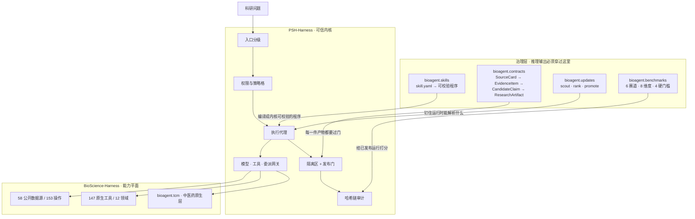
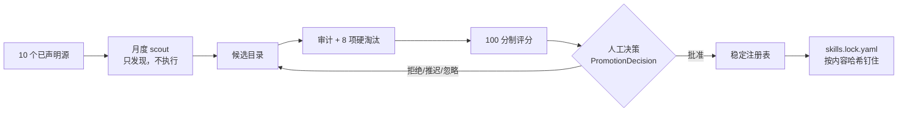

<div align="center">

# TCMScience

### 全球首个面向中医药的受治理自主科研智能体

### The first governed autonomous research agent for Traditional Chinese Medicine

**让语言模型推理，但不让它定义实验室的法则。**

*The model may reason. It does not define the laws of the laboratory.*

[](https://github.com/psknlr/TCMScience/actions/workflows/ci.yml)
[](https://opensource.org/licenses/MIT)
[](https://www.python.org/downloads/)


---

## ⚡ 30 秒跑起来

**不需要安装、不需要配置、不需要 API key、不联网。**

```bash
cd BioScience-Harness
python examples/run_skills.py
```

输出四个中医药 Skill 的完整结果，包括每个的**局限声明**和**发布门裁决**：

```
5/5 artifacts passed the publication gate
```

**这就是全部。** 想看更详细的安装与调用方式，跳到 [安装](#-安装) 或读 [INSTALL.md](INSTALL.md) / [USAGE.md](USAGE.md)。

</div>

---

## 「全球首个」具体指什么

笼统的「首个」不可证伪，所以我们把主张拆成四条**可以逐条核对**的：

| # | 主张 | 为什么在此之前不存在 |
|---|---|---|
| **1** | 首个把**中医药证据类型**做成不可互相塌缩的类型系统的科研智能体 | 此前所有医学 Agent 把证据当作文本或单一分级。中药的「经典记载」「炮制差异」「十八反」与「RCT」是不同种类的证据，混为一谈就会把古籍记载当成临床证据 |
| **2** | 首个让**计算预测在类型层面无法冒充临床事实**的系统 | 网络药理学输出的是预测关系，但文献里它常被表述成「作用机制」。我们把它做成内核的**类型约束**：预测性证据在设计表中只出现在 `MECHANISTIC` 一行，永远无法支撑 `CLINICAL`/`ASSOCIATION`/`SAFETY` |
| **3** | 首个把**证据设计（design）作为存储事实、把分级（tier）作为派生量**的中医药系统 | 旧的单一级分把 `in_vitro`（细胞）和 `animal`（动物）压成同一个 `PRECLINICAL`。两者能支撑的主张完全不同，塌缩掉就再也分不出来 |
| **4** | 首个**Skill 注册表与评测基准各自独立版本化**、且月度更新在结构上无法自动上线的中医药系统 | 若月度更新能改基准，本月分数与上月就不可比；若热门 Skill 能自动上线，可复现性就没了 |

**我们不做的主张**：不说「通用免疫力」、不说「认证级去标识化」、不说「不可篡改的执行环境」。内核自己的诚实声明适用于本仓库全部内容——见 [§ 我们不声称什么](#-我们不声称什么)。

---

## 它解决什么问题

一个科学智能体不能只是回答问题。

| 对话式 Agent | TCMScience 自主科研智能体 |
|---|---|
| 生成一个回答 | 构建并执行科研计划 |
| 检索文本 | 带**溯源与适用范围**地检索证据 |
| 机会性地调用工具 | 通过**类型化、策略门控**的能力调用 |
| 在自由文本里混合证据 | **分离**证据层级与主张类型 |
| 直接输出结论 | **隔离、核验、再发布** |
| 把中医当非结构化文本 | 原生建模药材、炮制、方剂、君臣佐使、证候、经典、十八反 |
| 对话记忆 | 只提交**受治理、已验证**的科研记忆 |
| 可能静默过度主张 | **必须显式暴露**无依据/外推的主张 |

### 为什么中医药尤其需要这个

中医药知识横跨**经典文献、本草、方剂、证候理论、现代分子证据、临床研究**——这些证据类型**不能被静默地塌缩成一种**。

一个把《伤寒论》条文和 RCT 都当作「证据文本」的系统，无法区分：
- 「古籍记载此方治此证」（attribution）
- 「有临床证据表明此方有效」（efficacy）

这两句话的证据门槛差了五个等级。

---

## 🚀 安装

### 方式一：直接跑，零安装

```bash
cd BioScience-Harness && python examples/run_skills.py
```

### 方式二：装成库

```bash
pip install -e "PSH-Harness[test]"           # 可信内核（含 pytest、hypothesis）
pip install -e "BioScience-Harness[dev]"     # 能力平面 + 治理层
```

> **注意 `[test]` 不能省。** PSH 的性质测试用 `importorskip("hypothesis")`，省掉的话 11 个测试模块会**静默跳过**而不是报错——你会看到一片绿，实际少跑了很多检查。

### 方式三：命令行

```bash
# 看看这个安装能跑什么
python -m bioagent.cli skills --dir BioScience-Harness/skills/tcm

# 跑一个 Skill
python -m bioagent.cli skill normalize-tcm-entities \
    --arg names=姜,白芍 --dir BioScience-Harness/skills/tcm

# 同样的东西，JSON 输出（给脚本用）
python -m bioagent.cli skill assess-tcm-safety \
    --arg subject=附子 --json --dir BioScience-Harness/skills/tcm
```

### 方式四：Python

```python
from bioagent.skills.p0 import assess_tcm_safety
from bioagent.contracts import validate_artifact

artifact = assess_tcm_safety("甘草", co_administered=["甘遂"])
verdict = validate_artifact(artifact)

print(artifact.composite_version_string)   # 四条版本轴，缺一不可复现
print(verdict.publishable, verdict.codes)
```

**共 1811 项测试**（PSH 958 · BioScience 853）：

```bash
cd PSH-Harness        && PYTHONPATH=src python -m pytest -q
cd BioScience-Harness && PYTHONPATH=src:../PSH-Harness/src python -m pytest -q -m unit
```

---

## 🏛 架构：三层，一个不可逾越的边界



**核心设计**：LLM 不应同时是自己的规划器、执行器、安全策略、证据裁判和发布权威。

因此 TCMScience 把**推理平面**与**可信执行平面**分开。模型生成的计划是类型化的、有界的、被校验的。数据在入口打标签。工具/模型/委派调用必须穿过显式网关。输出在发布前被隔离。科学主张在进入可信记忆前要核对证据范围与溯源。

---

## 🔬 证据治理：两处结构性设计

### 一、存储「设计」，派生「分级」

`EvidenceTier` 是单一序数，它把 `in_vitro`（细胞实验）和 `animal`（动物实验）**压成同一个 `PRECLINICAL`**。但这两种证据能支撑的主张完全不同——一个说的是细胞系，一个说的是完整生物体。

所以现在**存储的是更细的 study design，tier 是读出时派生的**。有损的那一步变得可见，而不是静默发生。PSH 的 `workflow.ir.DESIGNS` 本来就区分二者，本仓库的 `EMPIRICAL_DESIGNS` 与它逐字一致，有测试盯着。

### 二、计算预测不能变成临床事实

这一条由**内核的类型系统**执行，不是提示词要求。在 PSH 的主张-证据支撑表中，预测性设计只出现在**一行**：

```python
_SUPPORTS = {
    ClaimType.CLASSICAL:    {"classical_text"},
    ClaimType.TRADITIONAL:  {"classical_text", "expert_consensus"},
    ClaimType.MECHANISTIC:  EVIDENCE_DESIGNS - {...} | PREDICTIVE_DESIGNS,  # ← 唯一一行
    ClaimType.ASSOCIATION:  {"observational", "randomized_trial"},
    ClaimType.CLINICAL:     {"randomized_trial"},                          # ← 预测够不着
    ClaimType.SAFETY:       {"case_report", "observational", "randomized_trial"},
}
```

于是网络药理学 Skill **可以**从对接结果主张一个机制（这正是这类工具的用途），**不能**从它主张疗效、关联或安全性。

> **内核为此改了词汇表。** `DESIGNS` 原先无法表达「计算预测」——最接近的值是 `in_vitro`，那等于把仿真记录成湿实验。现在拆成 `EVIDENCE_DESIGNS | PREDICTIVE_DESIGNS`。

过度主张的 claim 是**可构造的**，由校验器拒绝，且「预测冒充事实」有专属错误码（`ART106` / `CLM004`）——因为**一个无法表示过度主张的系统，也测不出过度主张**，Claim Calibration 这一维度就会无分可打。

---

## 🧪 四个 P0 中医药 Skill

每个都是 `skill.yaml` 清单 + 一个纯函数，产出 `ResearchArtifact`。它们的共同点是**拒绝把模糊或缺失粉饰掉**。

| Skill | 它拒绝做什么 |
|---|---|
| `normalize-tcm-entities` | **拒绝在有歧义时替你选。** 「姜」是生姜（微温，解表）或干姜（热，温中回阳）——同株植物，不同的药，不同的主治。选一个会错一半，而且每次都显得很确定 |
| `retrieve-tcm-evidence` | **拒绝下判断。** 空结果就是空结果，不是「无效果」。未核查的撤稿保持 `unverified`。偏倚风险、精确度、一致性保持 `NOT_ASSESSED`——语料里没有可供判断的材料，默认给「low」就是编造发现 |
| `analyze-tcm-network-pharmacology` | **拒绝混淆预测与实测。** `predicted_targets` 与 `measured_targets` 是**不同的键**，没有合并列表。每条边标 `directness=EXTRAPOLATED`，清单禁止一切临床主张类型 |
| `assess-tcm-safety` | **拒绝回答「安全」。** 状态是 `risk_recorded` / `no_record` / `unknown`。**没有记录不等于安全**，产物里就是这么写的。十八反按**组合**检查（它是配对属性），严重度从不降级 |

### 一处被契约层纠正的设计

`assess-tcm-safety` 最初为十八反禁忌主张 `safety_signal`。校验器拒绝了——那一类主张的门槛是 `case_report`，而语料的记录是本草条目。

**拒绝是对的。** 「古籍记载两药相反」和「有临床证据证明该配伍有害」是两句不同的话，只有后者才是安全信号。把前者标成后者，等于把传统知识**升格**为临床证据。

现在 Skill 从**证据实际能支撑的**最强类型反推主张类型——语料将来若有了病例报告，同一个调用会自动开始返回 `safety_signal`，无需改代码。

---

## 📊 TCMScience Arena — 公开评测平台

**只读的公开评测界面**（`arena/web/`）。纯静态 HTML/CSS/JS——无构建步骤、无框架、无后端、无 CDN 依赖。双击 `index.html` 即可打开，也可直接部署 GitHub Pages。

**它只渲染，从不算分。** 评测在 Runner 里、在策略快照下执行，产出签名结果包写入冻结的基准注册表；站点渲染已发布的结果包，**永不计算分数、永不重新排名、永不写注册表**。这正是排行榜数字可信的原因——**网站改了也改不动结果**。

### 八个页面

| 页面 | 内容 |
|---|---|
| `index.html` | 总览、治理主张、关键数字 |
| `leaderboard.html` | 排行榜：八维度**永远展开**，可信/实验分榜，赛道与类型筛选，可排序 |
| `benchmarks.html` | 六大赛道、赛季、数据源与许可、评分规则 |
| `skills.html` | 稳定/候选技能注册表：版本、提交、许可、权限、基准增量 |
| `methods.html` | 方法论：评分定义、硬门槛、聚合公式、利益冲突、版本策略 |
| `run.html` | 单次运行详情：trace、证据、产物、逐条主张裁决 |
| `submit.html` | 三种提交方式与评测流程 |
| `compare.html` | 两系统逐赛道对比 |

### 六大赛道

| 赛道 | 核心指标 | 每赛道 |
|---|---|---|
| `TCM-Entity` | 实体准确率、歧义保留率、错误合并率 | 20 例 |
| `TCM-Evidence` | Recall@K、nDCG、引用有效率、研究设计分类 | 20 例 |
| `TCM-NetPharm` | 边溯源率、实测/预测分离度、富集复现率 | 20 例 |
| `TCM-Safety` | 风险召回率、严重假阴性率、证据充分性 | 20 例 |
| `TCM-TrialAudit` | STRICTA / SPIRIT-TCM / CONSORT-CHM 覆盖率 | 20 例 |
| `TCM-End2End` | 产物完整性、复跑成功率、主张校准 | 20 例 |

**合计 120 例**：60 公开开发集 · 40 隐藏测试集 · 20 对抗集。

### 两条渲染层强制规则

- **每个分数都必须分解。** 八个维度永远同时可见；只显示聚合值的排行榜行会让 `scripts/check_arena_data.py` **构建失败**
- **被门槛拦下的运行要显示，不能删。** 硬门槛拦的是**榜位**，不是分数——编造引用的运行仍有其 `task_success` 值，归零会掩盖系统其余部分的工作。它出现在标注为「实验」的榜上，**不带分解和拦截原因**

### 结果如何保存

```
Runner 沙箱执行 → 签名结果包 → 冻结的 Benchmark Registry
                                        ↓
              scripts/build_arena_data.py （唯一写入者）
                                        ↓
                        arena/web/data/*.json （生成物，被 gitignore）
                                        ↓
                        Arena 站点只读渲染，不写任何东西
```

**为什么不让网站存分数**：网站能改分，分数就不可信；网站被攻破，结果也不该受影响。这是 ADR-0004。

### 聚合方式

加权**调和平均**，而非几何平均。原因：几何平均只要有一项为零，整体即为零——那会让「某一维度失败」和「什么都没做出来」变得无法区分。调和平均同样被最弱维度主导（系统必须在溯源**和**安全上都行，不能只擅长其一），但零值读作「这一项很弱」而非抹掉整行。

---

## 📦 仓库结构

```text
TCMScience/
├── PSH-Harness/                      可信内核
│   └── src/psh/
│       ├── kernel/                   权限 · 出口 · 隔离 · 发布
│       ├── evidence/                 主张范围 · 支撑 · 签名
│       └── workflow/                 科学 IR + 编译器
├── BioScience-Harness/               能力平面
│   ├── src/bioagent/
│   │   ├── contracts/                四份科研数据契约 + 校验器
│   │   ├── skills/                   加载器 · 编译器 · 四个 P0 Skill
│   │   ├── updates/                  scout · ranker · registry · promotion
│   │   ├── benchmarks/               cases · splits · scorers · gates
│   │   ├── tcm/                      中医药原生对象 + 种子语料
│   │   └── psh/                      通向内核的桥
│   ├── skills/tcm/<name>/            skill.yaml + SKILL.md
│   ├── registry/                     skills.lock.yaml · skill_sources.yaml
│   └── examples/run_skills.py        ← 从这开始
├── arena/web/                        只读评测站点（8 页）
├── scripts/                          arena 构建 + CI 检查
├── docs/adr/                         四份架构决策记录
└── .github/workflows/                ci · monthly-scout · benchmark · release · arena
```

### 四份架构决策

| ADR | 决策 |
|---|---|
| [0001](docs/adr/0001-three-registry-separation.md) | 候选/稳定/赛季三级注册表分离；晋级单向且必须人工 |
| [0002](docs/adr/0002-independent-version-axes.md) | 运行时、Skill、数据源、基准**各自独立版本化**；结果必须同时标明四条 |
| [0003](docs/adr/0003-skill-yaml-compilation-contract.md) | `skill.yaml` 是编译契约；`SKILL.md` 永不参与权限推导 |
| [0004](docs/adr/0004-arena-read-only-static-first.md) | Arena 只读且静态优先；永不算分 |

---

## 🔄 月度 Skill 发现：能发现，不能上线



自动化**做不到**的事才是关键：

- **不能晋级。** `Registry.promote` 是稳定条目的唯一写入者，且必须传入 `PromotionDecision`；后者拒绝空的 `decided_by`——**无署名的批准不是批准**。scout CLI 根本没有晋级参数
- **硬淘汰先于评分。** 八项淘汰条件跑在评分之前，高分**不能**抵销许可证问题
- **赛季冻结后无法晋级。** 冻结在进程内不可逆——解冻会成为「让不方便的对比消失」的手段
- **社区热度上限 5/100**，由测试断言，不是靠权重自觉
- **scout 无法访问白名单外的主机**，提交的 URL 不能让运行时去意料之外的地方

---

## ⚠️ 我们不声称什么

**TCMScience 不声称对提示注入的通用免疫力、不声称认证级去标识化、不声称不可篡改的执行环境。**

- 进程内运行的组件**没有任何隔离**；出口代理只管遵守代理变量的客户端，裸 socket 可以绕过
- 随包发布的沙箱后端是 **no-op，并且它自己这么说**
- 分类器是安全网，**不是**认证级去标识化
- 审计链是**防篡改可察觉**，不是防篡改

真正的能力隔离需要容器运行时或操作系统级沙箱，两者都不在当前交付配置中。

### 本仓库发布什么，不发布什么

**发布**：运行时、Skill 清单与实现、注册表与锁文件、基准框架与评分器、Arena 站点、CI、架构决策。

**不发布**：基准用例与其黄金答案（公开的黄金答案会污染所有克隆者的评测）、以及论文（尚未上 arXiv）。`.gitignore` 强制执行，`scripts/check_leakage.py` 验证，且有测试对植入的泄漏用例做检验——**一个永远只报「干净」的扫描器，和一个坏掉的扫描器无法区分**。

---

## 👥 Authors

**Yanlan Kang¹† · Ruiqi Liu²† · Shuai Xu³\* · Xukun Zhang⁴\* · [William Cheng-Chung Chu](https://www.sciopen.com/scholar/info?id=1952658822209773569)⁵\***

¹ Institute of Medical Philosophy & Future AI (IMPF-AI)
² Shanghai Medical College, Fudan University
³ Shanghai Ziranerran Traditional Chinese Medicine Foundation
⁴ Li Ka Shing Faculty of Medicine, The University of Hong Kong
⁵ Fuyao University of Science and Technology

† 同等贡献　\* 共同通讯作者

---

## 📖 引用

```bibtex
@software{kang2026tcmscience,
  title        = {TCMScience: An Autonomous Scientist for Traditional Chinese Medicine},
  author       = {Kang, Yanlan and Liu, Ruiqi and Xu, Shuai and Zhang, Xukun and Chu, William Cheng-Chung},
  year         = {2026},
  url          = {https://github.com/psknlr/TCMScience},
  note         = {Open-source research software}
}
```

---

<div align="center">

### TCMScience

**从经典知识到可验证证据。从科研智能体到自动中医药科学家。**

*From classical knowledge to testable evidence. From AI agents to an autonomous TCM scientist.*

</div>
